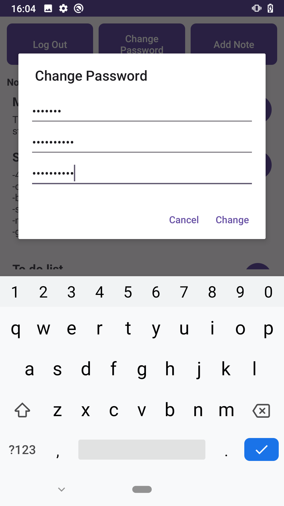

# AES-secured-notepad

Głównym celem projektu jest zastosowanie jak najlepszych mechanizmów szyfrujących do bezpiecznego przechowywania notatek. Dostęp do notatek wymaga każdorazowo zalogowania z użyciem hasła. Aplikacja jest przystosowana do obsługi wielu użytkowników. 

### Wykorzystane mechanizmy bezpieczeństwa

1. Maksymalnie 5 prób logowania na 1 minutę. Zabezpiecza to przed atakami brute-force.
2. Hasło użytkownika jest haszowane z wykorzystaniem losowej soli oraz funkcji key-stretching która wykonuje 1000 iteracji.
3. Klucz do szyfrowania notatek algorytmem AES-256 jest generowany z hasła. Program wykorzystuje w tym celu PBKDF2 z HMAC-256. Liczba iteracji key-strethingu to 65536. 
4. Szyfrowanie notatki odbywa się w trybie CBC z losowym wektorem początkowym. 
5. Przy każdej edycji/usunięciu/dodaniu notatki wszystkie dane zostają przeszyfrowane z wykorzystaniem nowej soli oraz nowego wektora początkowego. Wpływa to co prawda na płynność działania aplikacji, lecz jej głównym celem jest zastosowanie mechanizmów kryptograficznych.

### Zrzuty ekranu z działania aplikacji

